# Last Bite - Project Documentation

## Project Description
Last Bite is a web application aimed at combating food waste. The platform connects hotels and restaurants with surplus food to college students and workers seeking affordable, nutritious meals. By providing real-time listings, seamless reservations, and straightforward pick-up processes, Last Bite turns perfectly good leftover meals into an affordable community resource.

## System Architecture Overview
Layered Architecture.
- **Presentation Layer (Frontend):** Next.js (App Router) serving responsive React components, communicating with the backend via Axios/React Query.
- **Application Layer (API & Business Logic):** Django Rest Framework handling routing (`urls.py`), request validation and formatting (`serializers.py`), and core business logic (`views.py`).
- **Data Access Layer (ORM):** Django Models serving as the definitive map to the PostgreSQL database, executing queries and ensuring data integrity (`models.py`).
- **Database Layer:** PostgreSQL database storing structured relational data.

## User Roles & Permissions
1. **Student / Worker (Consumers):**
   - Can browse available meals and filter by dietary preferences/price.
   - Can reserve meals, view their active bookings, and upload payment slips.
2. **Business Owner (Providers):**
   - Can create, edit, and publish meal listings.
   - Can view incoming bookings for their meals.
   - Can verify or reject payment slips to mark meals ready for pickup.
3. **Admin (System Administrators):**
   - Has full access to the Admin Panel.
   - Can manage users, monitor daily booking graph. 

## Technology Stack
- **Frontend:** Next.js, React, TailwindCSS, React Query, Axios.
- **Backend:** Python, Django, Django Rest Framework (DRF), SimpleJWT.
- **Database:** PostgreSQL.
- **Tooling:** Docker Compose, Pillow (for image processing).

## Installation & Setup Instructions

### Environment Prerequisites
- Node.js (v18+)
- Python (3.10+)
- PostgreSQL (or Docker/Docker Compose)

### Option A: Using Docker (Recommended)
Docker is the easiest way to get the entire project (database and backend) running quickly.

1. Ensure Docker and Docker Compose are installed and running.
2. Build and start the containers from the project root:
```bash
docker-compose up --build -d
```
3. Create a superuser (admin account) inside the running backend container. Make sure you provide a valid email address (e.g., `admin@example.com`):
```bash
docker exec -it lastbite_backend python manage.py createsuperuser
```
4. The backend will now be available at `http://localhost:8000`, and the frontend application will be running at `http://localhost:3000`.

### Option B: Manual Setup

#### 1. Database Setup
Ensure PostgreSQL is running and create the database:
```bash
psql postgres -c "CREATE DATABASE lastbite_db;"
```

#### 2. Backend Setup
Navigate to the backend folder and set up the environment:
```bash
cd backend
python -m venv venv
source venv/bin/activate
pip install -r requirements.txt
cp .env.example .env  # Update the database credentials in .env
python manage.py makemigrations
python manage.py migrate
python manage.py createsuperuser  # Create an admin account using an email
```

#### 3. Frontend Setup
Navigate to the frontend folder:
```bash
cd frontend
npm install
# Or yarn install / pnpm install
```

## How to Run the System

### Running the Backend (If using Manual Setup)
From the `backend` directory with your virtual environment activated:
```bash
python manage.py runserver
```
The backend API will run at `http://localhost:8000`.

### Running the Frontend
From the `frontend` directory:
```bash
npm run dev
```
The frontend application will be accessible at `http://localhost:3000`.

## Screenshots
### Login and Registeration
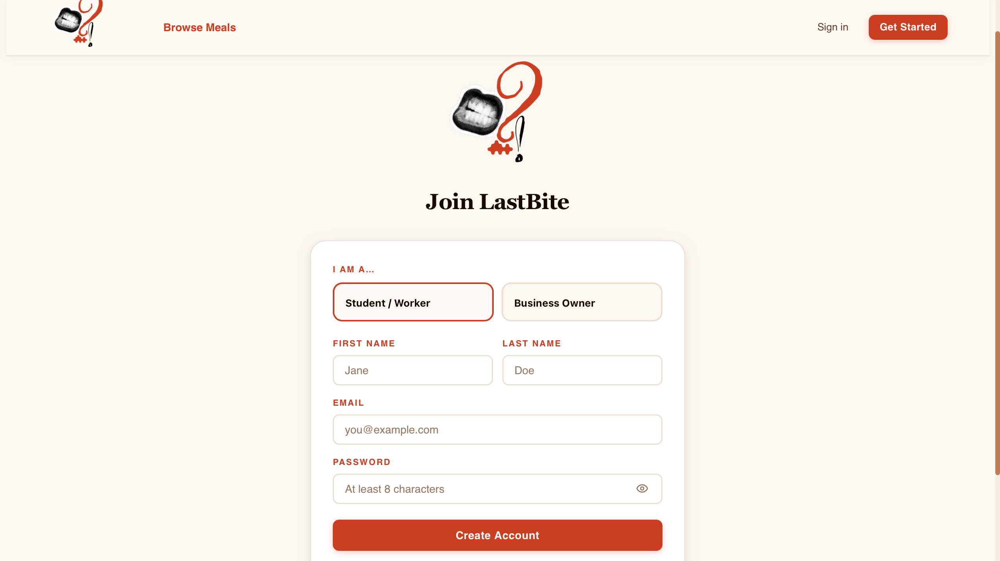
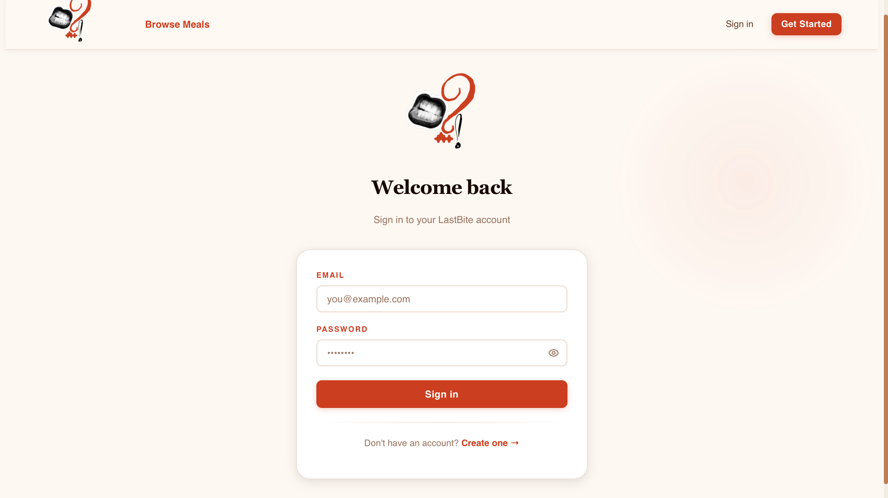

## Browse Meal
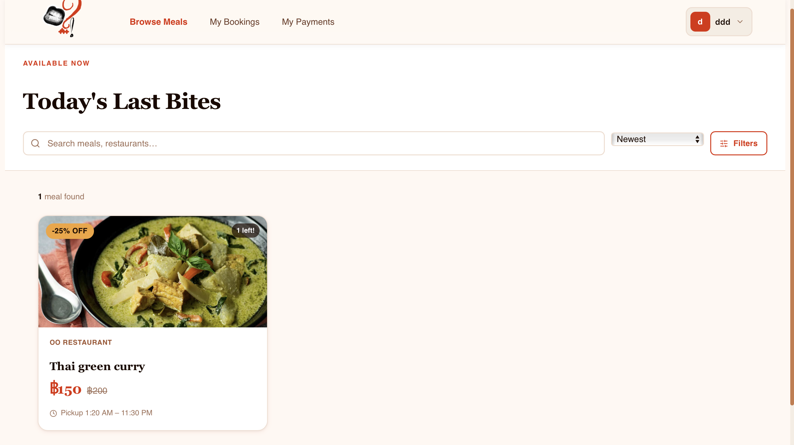

## Create Meal
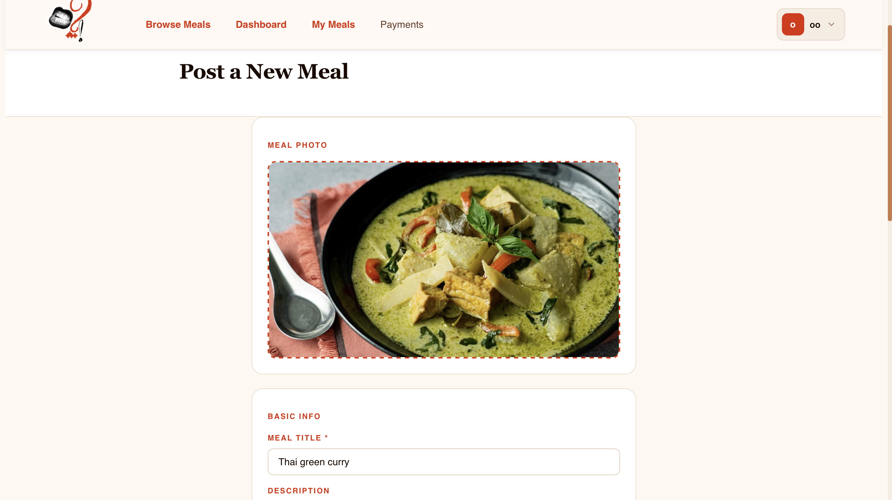
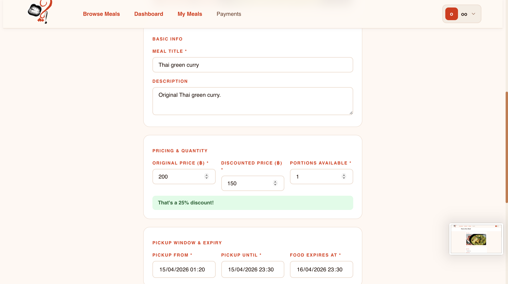
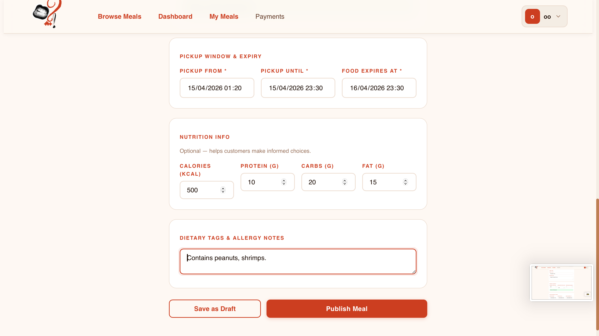

## Meal Detail
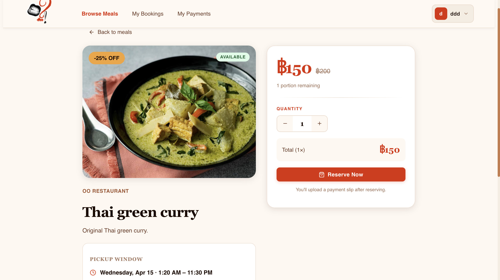
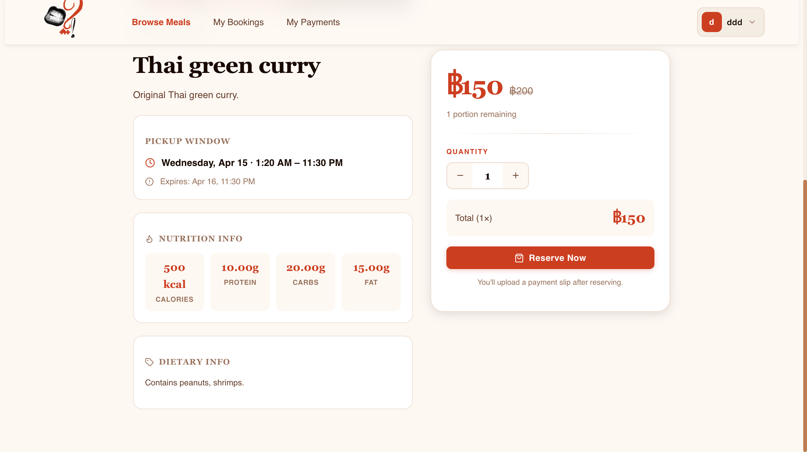

## Booking
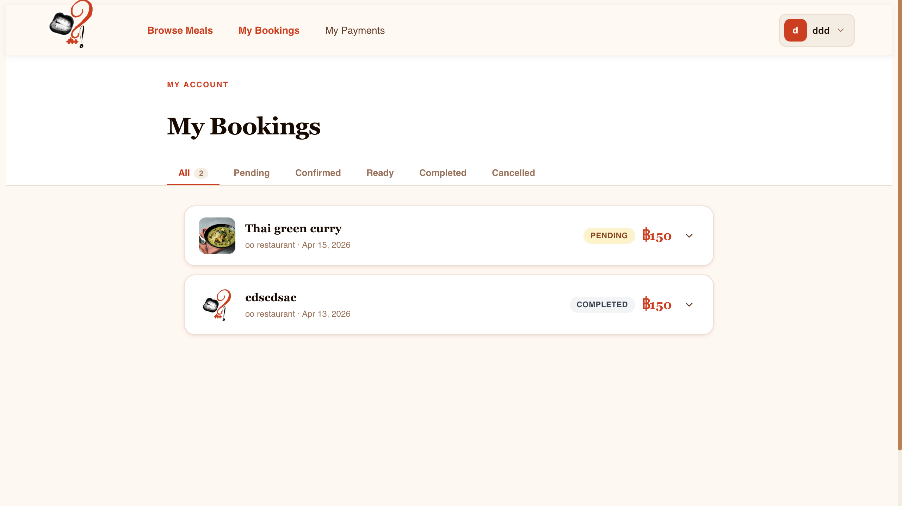
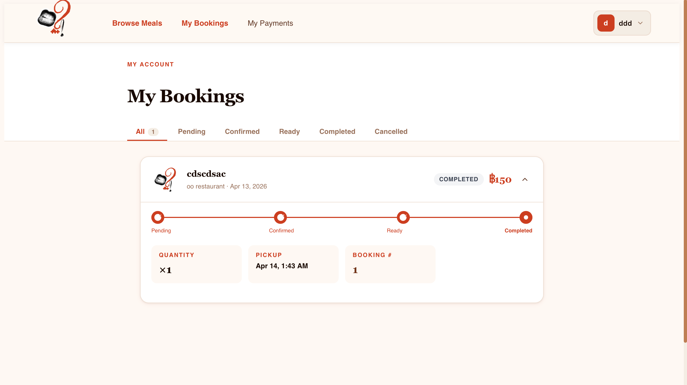

## Restaurant Dashboard
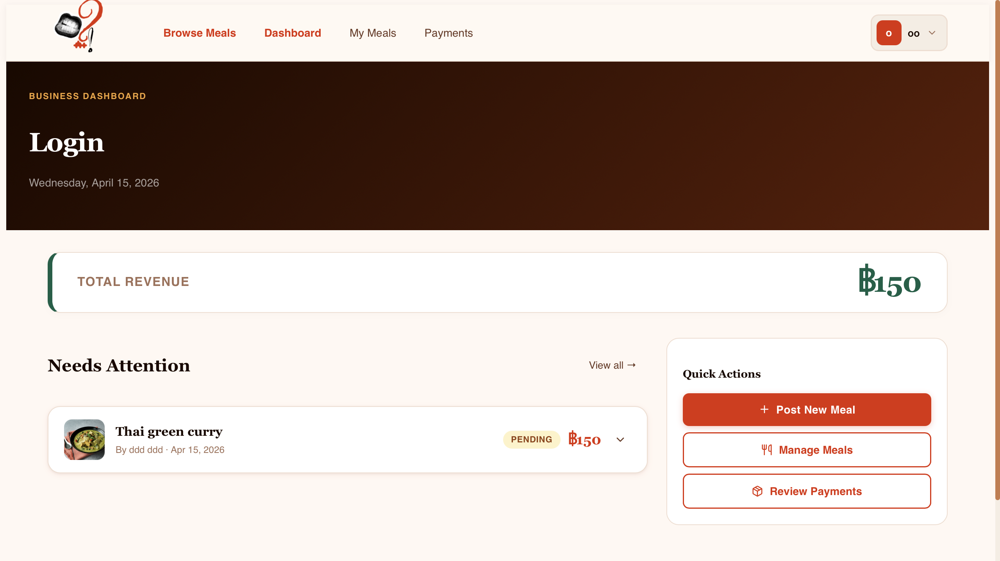

## Restaurant Payment Slip Review
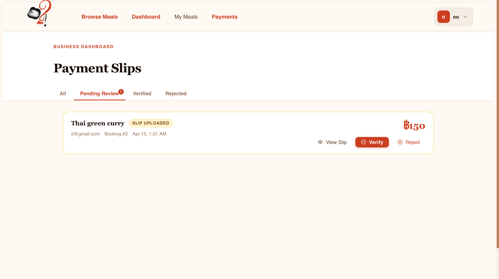

## Student Payment History
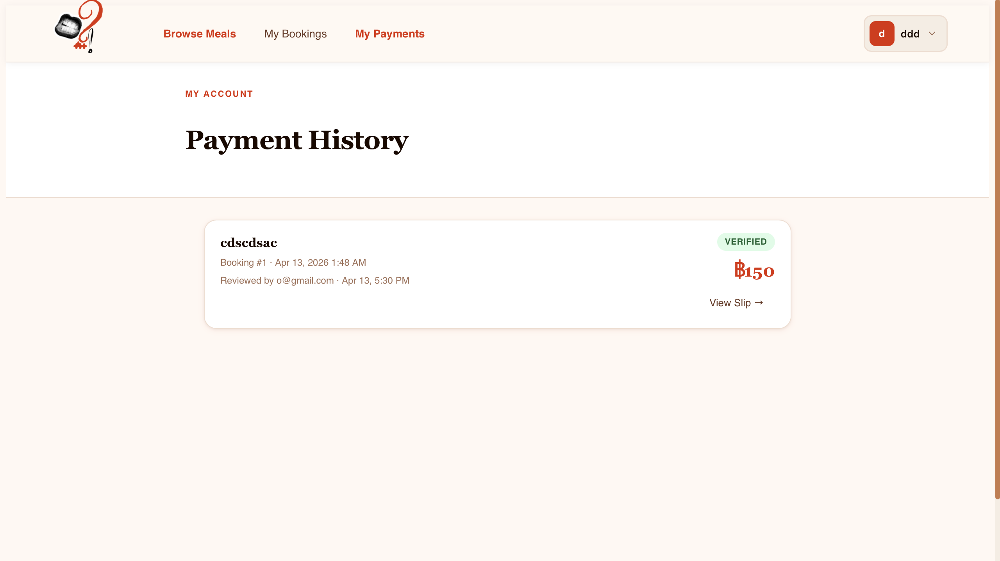

## Student Confirm Recieve Food
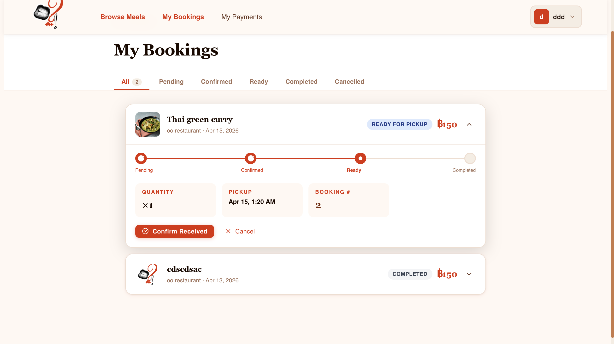

## Admin Panel
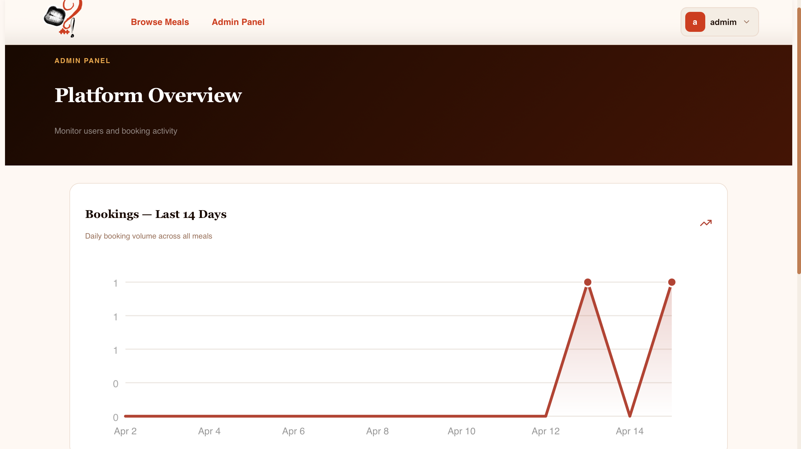
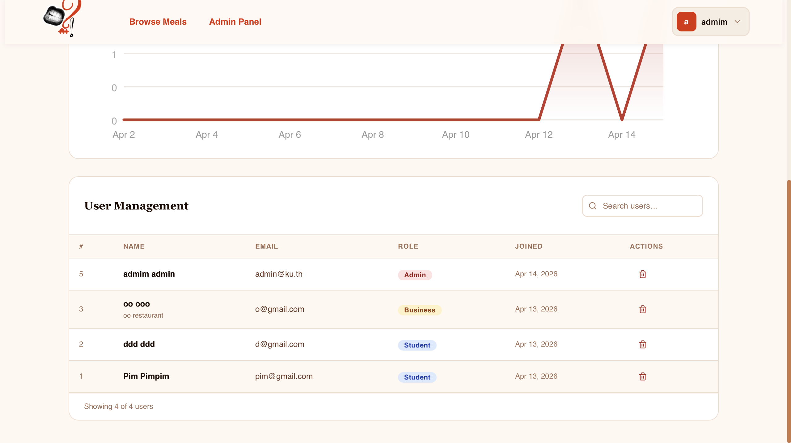